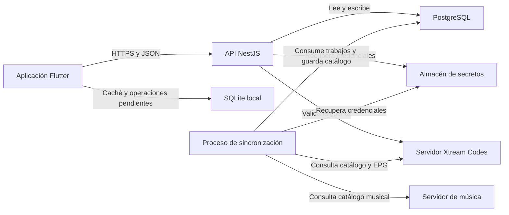

# Arquitectura de la aplicación IPTV y música

## Objetivo

Construir una aplicación para Android e iOS que permita iniciar sesión en un servidor compatible con Xtream Codes, consultar su catálogo y reproducir televisión en vivo, películas y series. La aplicación también tendrá un catálogo de música alojado en un servidor independiente.

Este documento define la estructura propuesta del proyecto, sus componentes y el orden de implementación.

## Funcionalidades

- Inicio de sesión con URL del servidor, usuario y contraseña.
- Administración de conexiones y perfiles.
- Canales en vivo organizados por categorías.
- Guía de programación EPG.
- Películas con ficha y reproducción.
- Series organizadas por temporadas y episodios.
- Reproducción de HLS y MPEG-TS según compatibilidad del dispositivo.
- Música organizada por artistas, álbumes y canciones.
- Listas de reproducción y música descargada en el teléfono.
- Búsqueda, favoritos, historial y reanudación.
- Preferencias de idioma, zona horaria y control parental.

## Tecnologías

| Componente | Tecnología | Responsabilidad |
|---|---|---|
| Aplicación móvil | Flutter y Dart | Interfaz compartida para Android e iOS. |
| Backend | NestJS y TypeScript | Autenticación, permisos, catálogo e integración con proveedores. |
| Base de datos central | PostgreSQL | Usuarios, catálogo, EPG y actividad. |
| Base de datos local | SQLite | Caché, descargas y operaciones pendientes. |
| Reproductor Android | Media3 y ExoPlayer | Reproducción mediante un adaptador nativo. |
| Reproductor iOS | AVPlayer | Reproducción mediante un adaptador nativo. |
| Sesión local | Almacenamiento protegido por Keychain o Keystore | Protección de tokens de la aplicación. |
| Contrato de API | OpenAPI | Definición de rutas, peticiones, respuestas y errores. |
| Despliegue inicial | Docker Compose y proxy HTTPS | API, proceso de sincronización y PostgreSQL. |

## Arquitectura general



La aplicación consulta los datos mediante la API. PostgreSQL permanece en la red privada del backend.

La API registra trabajos de sincronización en PostgreSQL. Un proceso separado del mismo proyecto los ejecuta, consulta los proveedores y actualiza el catálogo.

### Entrega de audio y vídeo

1. La aplicación solicita reproducir un contenido.
2. La API comprueba la cuenta, el perfil, el dispositivo y el acceso al contenido.
3. La API devuelve la URL de reproducción, el formato y las cabeceras necesarias.
4. El reproductor obtiene el audio y el vídeo desde el servidor de origen.
5. La aplicación envía actividad y progreso a la API.

Si un stream requiere adaptación para el dispositivo, un gateway multimedia lo recibe y entrega una variante compatible. Este gateway será un servicio separado y se incorporará cuando las pruebas de reproducción lo requieran.

## Estructura del repositorio

```text
media-app/
├── .github/
│   └── workflows/
│       ├── mobile.yml
│       └── backend.yml
├── apps/
│   ├── mobile/
│   │   ├── android/
│   │   ├── ios/
│   │   ├── assets/
│   │   │   ├── icons/
│   │   │   └── images/
│   │   ├── lib/
│   │   │   ├── main.dart
│   │   │   ├── bootstrap.dart
│   │   │   ├── app/
│   │   │   │   ├── app.dart
│   │   │   │   ├── app_router.dart
│   │   │   │   ├── app_theme.dart
│   │   │   │   └── dependencies.dart
│   │   │   ├── core/
│   │   │   │   ├── config/
│   │   │   │   │   └── app_config.dart
│   │   │   │   ├── errors/
│   │   │   │   │   └── app_failure.dart
│   │   │   │   ├── network/
│   │   │   │   │   ├── api_client.dart
│   │   │   │   │   └── auth_interceptor.dart
│   │   │   │   ├── storage/
│   │   │   │   │   ├── local_database.dart
│   │   │   │   │   ├── secure_session_store.dart
│   │   │   │   │   └── local_file_store.dart
│   │   │   │   ├── sync/
│   │   │   │   │   ├── pending_operation.dart
│   │   │   │   │   └── local_sync_service.dart
│   │   │   │   ├── player/
│   │   │   │   │   ├── player_controller.dart
│   │   │   │   │   └── player_state.dart
│   │   │   │   └── widgets/
│   │   │   │       ├── loading_view.dart
│   │   │   │       ├── empty_view.dart
│   │   │   │       └── error_view.dart
│   │   │   └── features/
│   │   │       ├── auth/
│   │   │       │   ├── presentation/
│   │   │       │   ├── domain/
│   │   │       │   └── data/
│   │   │       ├── profiles/
│   │   │       │   ├── presentation/
│   │   │       │   ├── domain/
│   │   │       │   └── data/
│   │   │       ├── connections/
│   │   │       │   ├── presentation/
│   │   │       │   ├── domain/
│   │   │       │   └── data/
│   │   │       ├── home/
│   │   │       │   ├── presentation/
│   │   │       │   ├── domain/
│   │   │       │   └── data/
│   │   │       ├── live_tv/
│   │   │       │   ├── presentation/
│   │   │       │   ├── domain/
│   │   │       │   └── data/
│   │   │       ├── movies/
│   │   │       │   ├── presentation/
│   │   │       │   ├── domain/
│   │   │       │   └── data/
│   │   │       ├── series/
│   │   │       │   ├── presentation/
│   │   │       │   ├── domain/
│   │   │       │   └── data/
│   │   │       ├── music/
│   │   │       │   ├── presentation/
│   │   │       │   ├── domain/
│   │   │       │   └── data/
│   │   │       ├── playback/
│   │   │       │   ├── presentation/
│   │   │       │   ├── domain/
│   │   │       │   └── data/
│   │   │       ├── library/
│   │   │       │   ├── presentation/
│   │   │       │   ├── domain/
│   │   │       │   └── data/
│   │   │       ├── downloads/
│   │   │       │   ├── presentation/
│   │   │       │   ├── domain/
│   │   │       │   └── data/
│   │   │       └── settings/
│   │   │           ├── presentation/
│   │   │           ├── domain/
│   │   │           └── data/
│   │   ├── test/
│   │   │   ├── core/
│   │   │   └── features/
│   │   ├── integration_test/
│   │   │   ├── login_test.dart
│   │   │   ├── playback_test.dart
│   │   │   └── offline_music_test.dart
│   │   ├── analysis_options.yaml
│   │   ├── pubspec.yaml
│   │   └── pubspec.lock
│   └── backend/
│       ├── src/
│       │   ├── main.ts
│       │   ├── app.module.ts
│       │   ├── worker.ts
│       │   ├── worker.module.ts
│       │   ├── config/
│       │   │   └── environment.ts
│       │   ├── database/
│       │   │   ├── database.module.ts
│       │   │   └── database.service.ts
│       │   ├── common/
│       │   │   ├── guards/
│       │   │   │   ├── session.guard.ts
│       │   │   │   └── ownership.guard.ts
│       │   │   ├── filters/
│       │   │   │   └── exception.filter.ts
│       │   │   ├── logging/
│       │   │   │   └── safe-logger.service.ts
│       │   │   └── secrets/
│       │   │       └── secret-store.service.ts
│       │   ├── modules/
│       │   │   ├── auth/
│       │   │   ├── profiles/
│       │   │   ├── devices/
│       │   │   ├── connections/
│       │   │   ├── catalog/
│       │   │   ├── series/
│       │   │   ├── epg/
│       │   │   ├── playback/
│       │   │   ├── library/
│       │   │   ├── music/
│       │   │   ├── downloads/
│       │   │   └── sync/
│       │   │       ├── sync.module.ts
│       │   │       ├── sync.controller.ts
│       │   │       ├── sync.service.ts
│       │   │       ├── sync-job.repository.ts
│       │   │       ├── sync-run.repository.ts
│       │   │       ├── sync.scheduler.ts
│       │   │       └── sync.processor.ts
│       │   └── integrations/
│       │       ├── xtream/
│       │       │   ├── xtream.module.ts
│       │       │   ├── xtream.client.ts
│       │       │   ├── xtream.mapper.ts
│       │       │   └── xtream.types.ts
│       │       ├── m3u/
│       │       │   ├── m3u.module.ts
│       │       │   └── m3u.parser.ts
│       │       ├── xmltv/
│       │       │   ├── xmltv.module.ts
│       │       │   └── xmltv.parser.ts
│       │       └── music-server/
│       │           ├── music-server.module.ts
│       │           ├── music-server.client.ts
│       │           └── music-server.mapper.ts
│       ├── migrations/
│       │   ├── 001_initial_schema.sql
│       │   ├── 002_auth_sessions.sql
│       │   └── 003_sync_jobs.sql
│       ├── test/
│       │   ├── unit/
│       │   ├── integration/
│       │   └── e2e/
│       ├── .env.example
│       ├── nest-cli.json
│       ├── package.json
│       ├── package-lock.json
│       └── tsconfig.json
├── packages/
│   └── native_player/
│       ├── lib/
│       │   ├── native_player.dart
│       │   └── src/
│       │       ├── player_engine.dart
│       │       ├── player_event.dart
│       │       └── playback_source.dart
│       ├── android/
│       │   └── src/
│       │       └── main/
│       ├── ios/
│       │   └── Classes/
│       ├── test/
│       └── pubspec.yaml
├── contracts/
│   └── openapi.yaml
├── infrastructure/
│   ├── compose.yaml
│   ├── backend.Dockerfile
│   ├── proxy/
│   │   └── nginx.conf
│   ├── postgres/
│   │   ├── backup.sh
│   │   └── restore.sh
│   └── .env.example
├── docs/
│   ├── ARQUITECTURA.md
│   ├── DATABASE.md
│   ├── DEVELOPMENT.md
│   └── DEPLOYMENT.md
├── .editorconfig
├── .gitignore
└── README.md
```

### Responsabilidades de las carpetas

| Ruta | Contenido |
|---|---|
| `apps/mobile` | Aplicación Flutter y configuración de Android e iOS. |
| `apps/mobile/lib/app` | Arranque, navegación, tema y composición de dependencias. |
| `apps/mobile/lib/core` | Servicios compartidos de red, almacenamiento, sincronización y reproducción. |
| `apps/mobile/lib/features` | Funcionalidades visibles para el usuario. |
| `apps/backend/src/modules` | Reglas de negocio y rutas de la API. |
| `apps/backend/src/integrations` | Comunicación y conversión de datos de proveedores externos. |
| `apps/backend/src/common` | Permisos, errores, logs y acceso a secretos. |
| `apps/backend/migrations` | Cambios SQL versionados. |
| `packages/native_player` | Interfaz común de reproducción y adaptadores Android/iOS. |
| `contracts` | Contrato de comunicación entre la app y el backend. |
| `infrastructure` | Configuración de despliegue y copias de seguridad. |
| `docs` | Documentación técnica. |

Los directorios de plataforma y archivos de configuración se completarán al crear los proyectos con sus herramientas. Los árboles muestran los archivos propios que organizarán el desarrollo.

## Organización de la aplicación móvil

Cada funcionalidad se divide en tres capas:

| Capa | Responsabilidad |
|---|---|
| `presentation` | Pantallas, componentes y modelos de vista que gestionan el estado visual. |
| `domain` | Modelos de la funcionalidad y contratos de repositorios. |
| `data` | Implementación de repositorios, peticiones a la API y acceso a caché. |

### Estructura de una funcionalidad

```text
movies/
├── presentation/
│   ├── screens/
│   │   ├── movies_screen.dart
│   │   └── movie_detail_screen.dart
│   ├── view_models/
│   │   ├── movies_view_model.dart
│   │   └── movie_detail_view_model.dart
│   └── widgets/
│       ├── movie_card.dart
│       └── movie_filters.dart
├── domain/
│   ├── models/
│   │   └── movie.dart
│   └── repositories/
│       └── movies_repository.dart
└── data/
    ├── repositories/
    │   └── movies_repository_impl.dart
    ├── services/
    │   ├── movies_api_service.dart
    │   └── movies_cache_service.dart
    └── mappers/
        └── movie_mapper.dart
```

La pantalla observa al modelo de vista. El modelo de vista usa el contrato del repositorio. Su implementación decide cuándo consultar la API y cuándo usar la caché.

Los modelos de `domain` no dependen de widgets, respuestas HTTP ni detalles de SQLite. Las dependencias se conectan en `app/dependencies.dart`.

### Módulos móviles

| Módulo | Pantallas y funciones |
|---|---|
| `auth` | Inicio de sesión, restauración y cierre de sesión. |
| `profiles` | Selección y administración de perfiles. |
| `connections` | Servidores, cuentas, caducidad y actualización de credenciales. |
| `home` | Inicio, contenido reciente, continuar viendo y búsqueda. |
| `live_tv` | Categorías, canales y guía EPG. |
| `movies` | Catálogo y ficha de películas. |
| `series` | Series, temporadas y episodios. |
| `music` | Canciones, artistas, álbumes, cola y minirreproductor. |
| `playback` | Pantalla de reproducción, controles y progreso. |
| `library` | Favoritos, historial y listas personales. |
| `downloads` | Descargas musicales y almacenamiento local. |
| `settings` | Idioma, zona horaria, control parental y preferencias. |

### Navegación

```text
Aplicación
├── Inicio de sesión
├── Selección de perfil
└── Navegación principal
    ├── Inicio
    │   ├── Continuar viendo
    │   ├── Añadidos recientes
    │   └── Búsqueda
    ├── TV en vivo
    │   ├── Categorías
    │   ├── Canales
    │   └── Guía EPG
    ├── Películas
    │   └── Detalle de película
    ├── Series
    │   └── Detalle de serie
    │       └── Temporadas
    │           └── Episodios
    ├── Música
    │   ├── Canciones
    │   ├── Artistas
    │   ├── Álbumes
    │   └── Cola de reproducción
    ├── Biblioteca
    │   ├── Favoritos
    │   ├── Historial
    │   ├── Listas personales
    │   └── Descargas
    └── Cuenta y ajustes
        ├── Perfiles
        ├── Conexiones
        ├── Preferencias
        └── Cerrar sesión
```

Inicio, TV, Películas, Series y Música forman la navegación principal. Biblioteca y ajustes se abren desde el perfil. El reproductor es una pantalla compartida que se abre desde cualquier contenido reproducible.

## Organización del backend

La API y el proceso de sincronización comparten módulos y repositorios. `main.ts` inicia el servidor HTTP y `worker.ts` inicia el procesamiento de trabajos.

### Estructura de un módulo

```text
catalog/
├── catalog.module.ts
├── catalog.controller.ts
├── catalog.service.ts
├── catalog.repository.ts
├── dto/
│   ├── list-catalog.dto.ts
│   └── catalog-item.dto.ts
├── models/
│   └── catalog-item.model.ts
└── mappers/
    └── catalog.mapper.ts
```

| Archivo o carpeta | Responsabilidad |
|---|---|
| `module.ts` | Registra y conecta las dependencias. |
| `controller.ts` | Recibe peticiones HTTP y valida parámetros. |
| `service.ts` | Ejecuta reglas de negocio y coordina operaciones. |
| `repository.ts` | Consulta y actualiza PostgreSQL. |
| `dto` | Define y valida los datos de entrada y salida. |
| `models` | Representa los datos que utiliza el módulo. |
| `mappers` | Convierte datos entre persistencia, modelos y respuestas. |

### Módulos del backend

| Módulo | Responsabilidad |
|---|---|
| `auth` | Validación de acceso, emisión, renovación y revocación de sesiones. |
| `profiles` | Perfiles y preferencias individuales. |
| `devices` | Registro de instalaciones de la app. |
| `connections` | Servidores, cuentas de proveedor y referencias a credenciales. |
| `catalog` | Categorías, contenido y búsqueda paginada. |
| `series` | Jerarquía de temporadas y episodios. |
| `epg` | Consulta de programación por canal y rango temporal. |
| `playback` | Autorización de reproducción, selección de variante y sesiones activas. |
| `library` | Favoritos, historial, progreso y listas personales. |
| `music` | Artistas, álbumes y canciones. |
| `downloads` | Autorización y estado de descargas musicales por dispositivo. |
| `sync` | Programación, ejecución, reintentos y resultados de importación. |

## Integración con los servidores

### Xtream Codes

Servidor inicial: `http://legazy.icu:8880`.

| Origen | Uso |
|---|---|
| `player_api.php` | Validar cuentas y consultar catálogo. |
| `get.php` | Obtener una lista M3U alternativa. |
| `xmltv.php` | Obtener la guía EPG. |
| `/live/` | Reproducir canales en vivo. |
| `/movie/` | Reproducir películas. |
| `/series/` | Reproducir episodios. |

El importador mantiene los identificadores del proveedor separados por conexión y tipo de contenido. Cuando una cuenta se consulta mediante API y M3U, ambos métodos deben resolver las mismas fichas para evitar duplicados.

La disponibilidad de los endpoints, HTTPS y los formatos se comprobará durante la integración. Las credenciales se guardan en el almacén de secretos del backend; PostgreSQL conserva su referencia.

### Servidor de música

El servidor musical ofrecerá un manifiesto o una API con identificadores estables de canciones, artistas, álbumes y archivos. Su URL y contrato se definirán antes de implementar el adaptador.

Los archivos permanecen en ese servidor. PostgreSQL guarda metadatos y referencias, y la aplicación puede descargar una copia al teléfono.

## Reproducción

`packages/native_player` define una interfaz común para abrir contenido, pausar, continuar, cambiar posición y recibir eventos de reproducción. Sus adaptadores usan los motores nativos de cada plataforma.

`core/player` administra el estado del reproductor en Flutter. La funcionalidad `playback` coordina la autorización mediante la API, la pantalla de reproducción y el envío de progreso.

### Compatibilidad

- Preferir HLS cuando el proveedor lo ofrezca.
- Probar MPEG-TS y los códecs reales en Android e iOS.
- Mantener la extensión original de películas y episodios.
- Usar un gateway TS a HLS cuando el dispositivo no pueda reproducir el origen directamente.
- Reempaquetar cuando los códecs sean compatibles y transcodificar cuando sea necesario.

La extensión del archivo no garantiza su reproducción. La combinación de protocolo, contenedor, códec y dispositivo determina la compatibilidad.

Una URL directa de Xtream puede exponer las credenciales al reproductor. Para ocultarlas al cliente, el gateway debe intermediar todos los recursos del stream, incluidos los segmentos HLS.

## Flujos principales

### Inicio de sesión

1. Capturar URL, usuario y contraseña.
2. Enviar las credenciales a la API mediante HTTPS.
3. Validar la cuenta con Xtream.
4. Crear o recuperar el usuario interno y su conexión.
5. Emitir una sesión propia de la aplicación.
6. Guardar la sesión en el almacenamiento seguro del dispositivo.
7. Programar la importación inicial.
8. Mostrar el perfil y el catálogo disponible.

### Sincronización del catálogo

1. Registrar un trabajo por conexión y ámbito.
2. Reclamar el trabajo mediante un bloqueo temporal.
3. Consultar catálogo, detalles de series, EPG o música.
4. Normalizar los datos y eliminar información sensible.
5. Insertar o actualizar por conexión, tipo e identificador externo.
6. Registrar el resultado en `sync_run`.
7. Retirar contenido ausente solo si la importación del ámbito terminó correctamente.
8. Actualizar la caché del móvil al volver a consultar el catálogo.

Los trabajos tendrán reintentos limitados y recuperación si el proceso se interrumpe. Los horarios EPG se almacenarán en UTC y se mostrarán en la zona del perfil.

### Reproducción y reanudación

1. Seleccionar un contenido.
2. Comprobar acceso, cuenta, dispositivo y sesiones activas.
3. Resolver una variante compatible.
4. Crear la sesión de reproducción y devolver el descriptor.
5. Abrir el reproductor.
6. Enviar actividad periódica y progreso al pausar o salir.
7. Cerrar la sesión al detenerse o por inactividad.

El proveedor controla el límite final de conexiones. La aplicación solo puede coordinar las sesiones que conoce.

### Música sin conexión

1. Autorizar la descarga y resolver el archivo.
2. Comprobar espacio disponible.
3. Descargar y mostrar el progreso.
4. Verificar tamaño e integridad cuando exista checksum.
5. Guardar el archivo y su referencia local.
6. Reproducir desde el dispositivo sin conexión.
7. Sincronizar el progreso pendiente cuando vuelva la red.

Las descargas son específicas de cada dispositivo. El acceso a música descargada después de caducar una cuenta dependerá de la política que se defina para la aplicación.

## API propuesta

Todas las rutas usarán el prefijo `/v1`. La API identificará al usuario mediante su sesión y comprobará la propiedad de perfiles, dispositivos, conexiones y contenidos.

| Método | Ruta | Función |
|---|---|---|
| `POST` | `/auth/xtream` | Validar Xtream e iniciar sesión. |
| `POST` | `/auth/refresh` | Renovar la sesión. |
| `POST` | `/auth/logout` | Revocar la sesión. |
| `GET` | `/profiles` | Listar perfiles. |
| `POST` | `/profiles` | Crear un perfil. |
| `PATCH` | `/profiles/:profileId` | Actualizar preferencias del perfil. |
| `POST` | `/devices` | Registrar el dispositivo. |
| `GET` | `/connections` | Listar conexiones. |
| `POST` | `/connections` | Añadir una conexión validada. |
| `PATCH` | `/connections/:connectionId` | Actualizar una conexión. |
| `GET` | `/catalog` | Consultar catálogo con filtros y cursor. |
| `GET` | `/catalog/:itemId` | Consultar una ficha. |
| `GET` | `/categories` | Listar categorías por conexión y tipo. |
| `GET` | `/series/:seriesId/seasons` | Consultar temporadas. |
| `GET` | `/seasons/:seasonId/episodes` | Consultar episodios. |
| `GET` | `/channels/:channelId/epg` | Consultar programación entre `from` y `to`. |
| `POST` | `/playback-sessions` | Autorizar e iniciar reproducción. |
| `PATCH` | `/playback-sessions/:sessionId` | Actualizar actividad o cerrar reproducción. |
| `PUT` | `/profiles/:profileId/progress/:itemId` | Guardar progreso con revisión. |
| `GET` | `/profiles/:profileId/history` | Consultar historial. |
| `GET` | `/profiles/:profileId/favorites` | Listar favoritos. |
| `PUT` | `/profiles/:profileId/favorites/:itemId` | Añadir un favorito. |
| `DELETE` | `/profiles/:profileId/favorites/:itemId` | Eliminar un favorito. |
| `GET` | `/profiles/:profileId/playlists` | Listar listas personales. |
| `POST` | `/profiles/:profileId/playlists` | Crear una lista. |
| `PATCH` | `/playlists/:playlistId` | Modificar una lista. |
| `DELETE` | `/playlists/:playlistId` | Eliminar una lista. |
| `GET` | `/playlists/:playlistId/items` | Consultar elementos en orden. |
| `POST` | `/playlists/:playlistId/items` | Añadir una entrada. |
| `PUT` | `/playlists/:playlistId/order` | Cambiar el orden de las entradas. |
| `DELETE` | `/playlists/:playlistId/items/:entryId` | Eliminar una entrada. |
| `GET` | `/music/artists` | Consultar artistas. |
| `GET` | `/music/albums` | Consultar álbumes. |
| `GET` | `/downloads` | Consultar descargas del dispositivo. |
| `POST` | `/downloads` | Autorizar una descarga musical. |
| `PATCH` | `/downloads/:downloadId` | Actualizar el estado de una descarga. |
| `POST` | `/connections/:connectionId/sync` | Solicitar sincronización. |
| `GET` | `/connections/:connectionId/sync` | Consultar su estado. |

Las canciones se consultarán en `/catalog` con `kind=track`. Las búsquedas de catálogo aceptarán conexión, tipo, categoría y texto. Las respuestas incluirán únicamente los campos necesarios para cada pantalla.

## Persistencia

### Base de datos central

El esquema inicial contiene 25 tablas:

| Área | Tablas |
|---|---|
| Identidad | `app_user`, `profile`, `device` |
| Conexiones | `media_source`, `source_connection` |
| Importación | `sync_run` |
| Catálogo | `media_item`, `category`, `media_category` |
| TV y EPG | `live_channel`, `epg_channel`, `epg_program` |
| Series | `season`, `episode` |
| Música | `artist`, `album`, `music_track`, `track_artist` |
| Reproducción | `playback_source`, `playback_session`, `playback_progress` |
| Biblioteca | `favorite`, `playlist`, `playlist_item` |
| Descargas | `music_download` |

`001_initial_schema.sql` se basará en el esquema entregado como `01_esquema.sql`.

La arquitectura añade dos migraciones pendientes de implementación:

| Migración | Nueva tabla | Contenido |
|---|---|---|
| `002_auth_sessions.sql` | `auth_session` | Usuario, dispositivo, hash del refresh token, caducidad y revocación. |
| `003_sync_jobs.sql` | `sync_job` | Conexión, ámbito, estado, intentos, próxima ejecución y vencimiento del bloqueo. |

`sync_job` organiza los trabajos pendientes. `sync_run` registra los resultados de cada ejecución.

### Almacenamiento en el dispositivo

| Ubicación | Datos |
|---|---|
| SQLite | Caché de catálogo, ventana EPG, descargas y cambios pendientes. |
| Almacenamiento seguro | Tokens de sesión de la aplicación. |
| Archivos privados de la app | Música descargada y recursos temporales. |

Las actualizaciones de progreso usarán `revision` para detectar conflictos entre dispositivos. La posición mayor no sustituirá automáticamente a la menor, ya que el usuario puede retroceder durante la reproducción.

## Convenciones de desarrollo

- Usar `snake_case` para archivos y carpetas Dart.
- Usar `kebab-case` para archivos TypeScript.
- Mantener el contrato HTTP en `contracts/openapi.yaml`.
- Aplicar cambios de base de datos mediante migraciones versionadas.
- Guardar únicamente nombres de variables y valores de ejemplo en `.env.example`.
- Excluir credenciales, archivos `.env`, bases locales y descargas del repositorio.
- Mantener las consultas a proveedores dentro de `integrations`.
- Mantener las consultas SQL dentro de los repositorios.
- Validar acceso al recurso en cada operación del backend.
- Representar carga, vacío, error y reintento en las pantallas.

## Orden de implementación

| Fase | Trabajo | Resultado verificable |
|---|---|---|
| 1 | Validar API, EPG, HTTPS y streams reales en Android/iOS. | Ruta de reproducción comprobada y decisión sobre el gateway. |
| 2 | Crear proyectos, migraciones, sesiones, login y perfiles. | Acceso, restauración y cierre de sesión con aislamiento entre cuentas. |
| 3 | Implementar sincronización, canales, categorías y EPG. | Reproducción de TV con programación en la hora correcta. |
| 4 | Implementar películas, series y biblioteca. | Reanudación de episodios entre dispositivos y perfiles. |
| 5 | Integrar el servidor musical y las descargas. | Reproducción de música desde el servidor y en modo avión. |
| 6 | Validar rendimiento, fallos de red, trabajos interrumpidos y despliegue. | Versiones Android/iOS instalables y recorridos principales aprobados. |

## Referencias

- [Arquitectura de aplicaciones Flutter](https://docs.flutter.dev/app-architecture/guide)
- [Módulos de NestJS](https://docs.nestjs.com/modules)
- [Formatos compatibles con Android Media3](https://developer.android.com/media/media3/exoplayer/supported-formats)
- [HTTP Live Streaming en Apple](https://developer.apple.com/documentation/http-live-streaming)
- [AVPlayer](https://developer.apple.com/documentation/avfoundation/avplayer)
